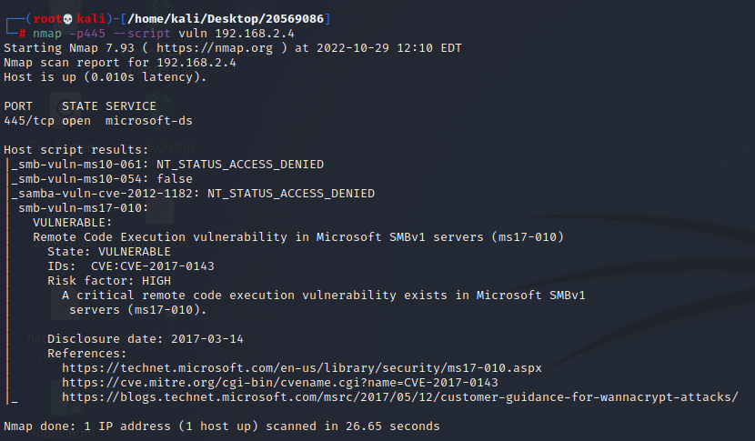
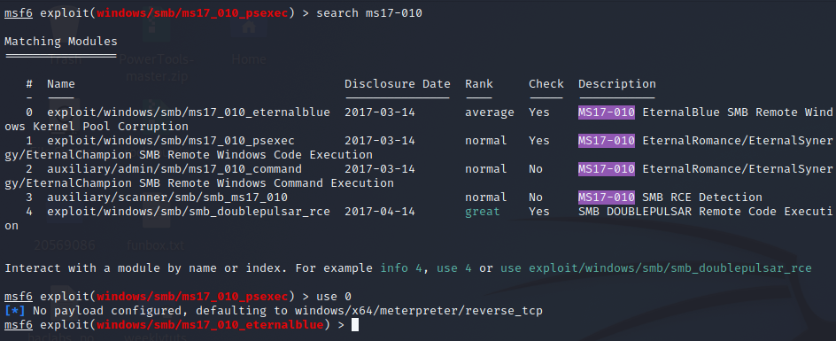
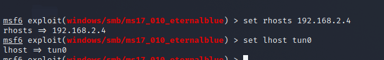
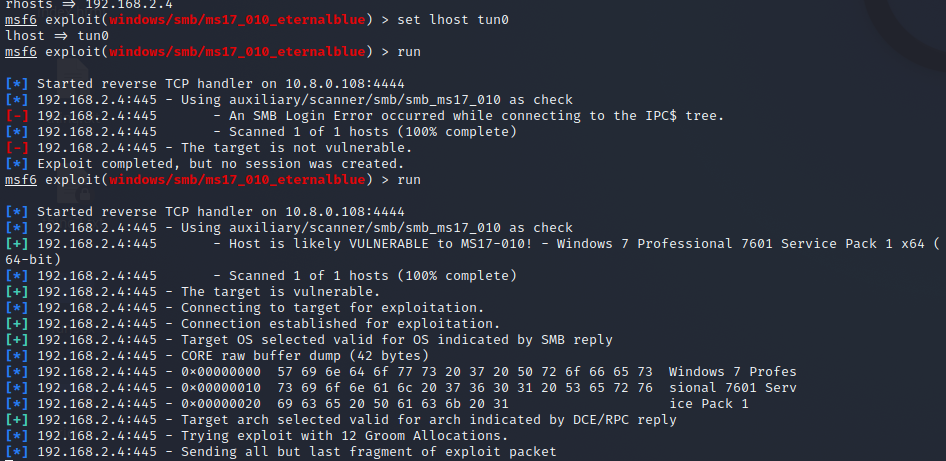
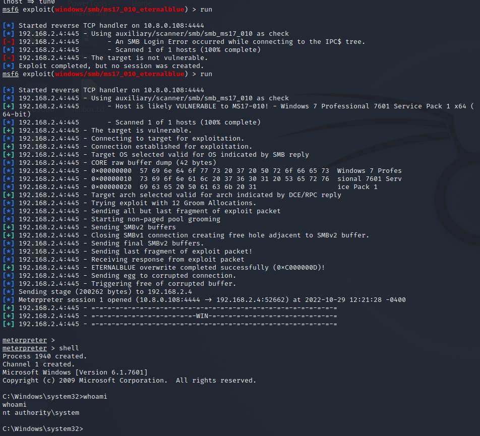

# Exercise 2: Caldera

192.168.2.4

I was stuck so I followed Sky Zhang’s Caldera walkthrough.

nmap script to scan for vulnerabilities. Caldera is vulnerable to EternalBlue exploit

Open up msfconsole and search for ms17-010

  

