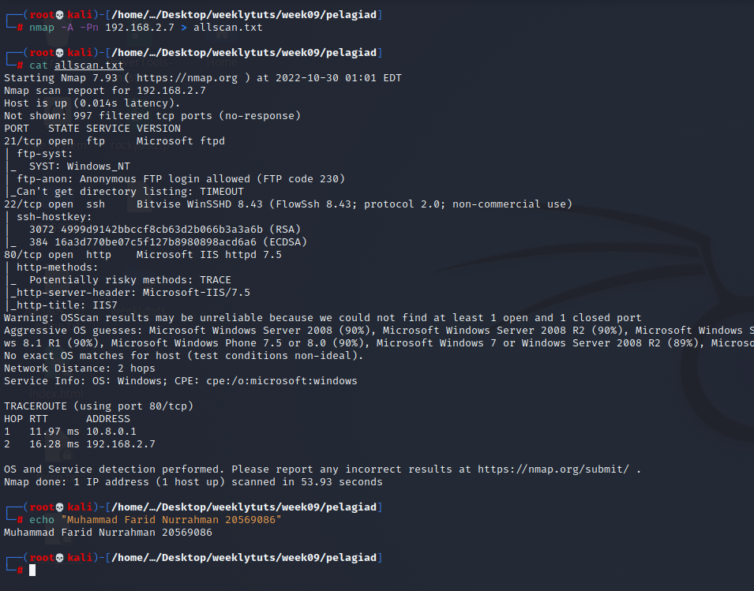
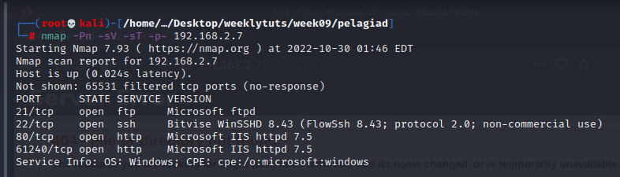
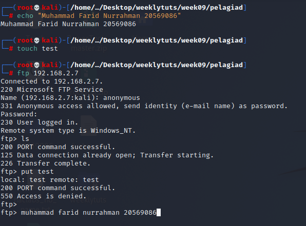
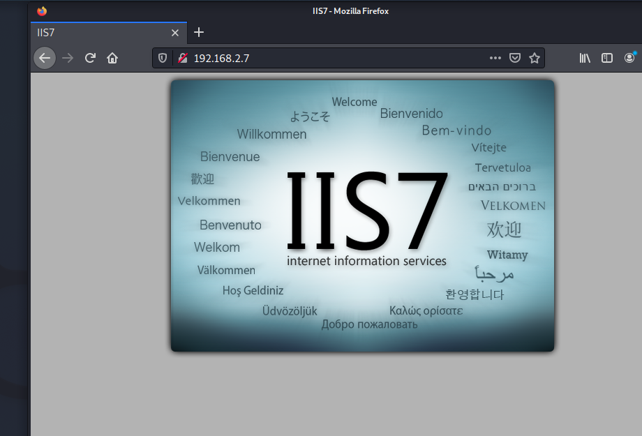
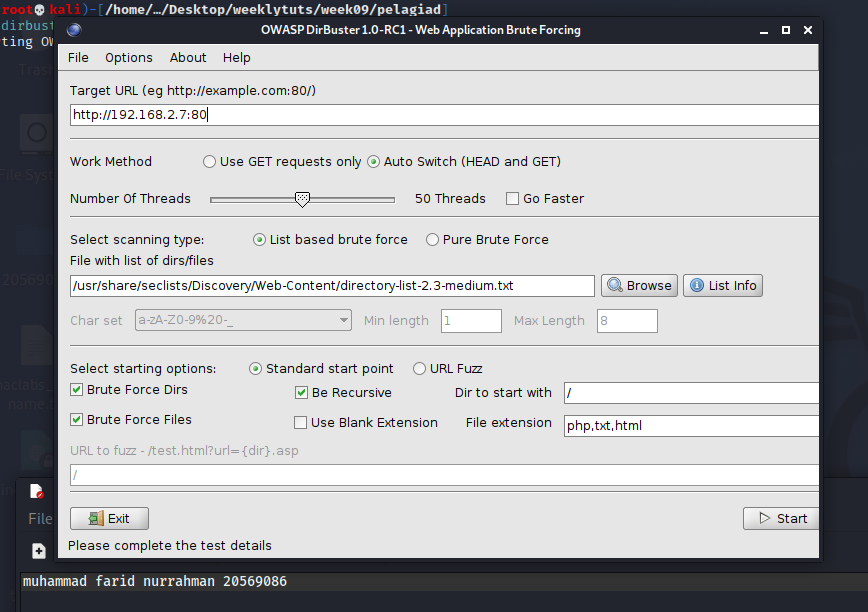

# Exercise 2: Pelagiad

Nmap scan:

 Almost missed port 61240

Anonymous ftp no upload perms  

Website on port 80:

Running dirbuster on port 80:  

No robots.txt

At this point I have no idea for an entry point. Seems like nobody else has figured it out too ☹
