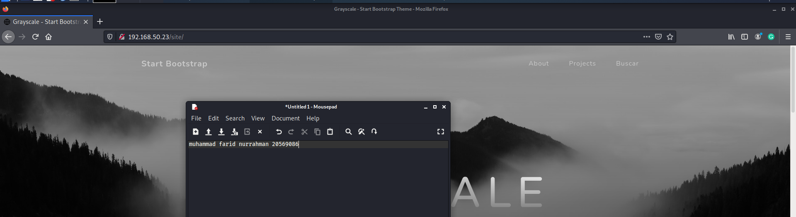
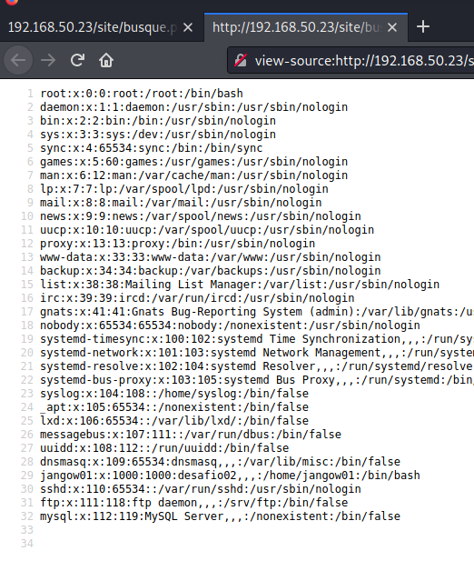

# Exercise 1: Jangow

nmap scan:  

Webpage:  

site/ redirects to a main page:

clicking on the buscar link leads here, seems like request

It executes bash commands

Get /etc/passwd

Located netcat, attempt to reverse shell but none are successful  

Seems like it is blocking outbound connections

Using port 443 works, however. Probably a misconfigured firewall setting. To upload linpeas we need to first serve it on kali using http server on port 80 and download it using wget (that means ending reverse shell connection) from url

Then, reverse shell again and execute linpeas

This version of linux is vulnerable to the dirtycow exploit. We compile dirtycow on our kali, send it over onto target machine via port 443, and execute it.
