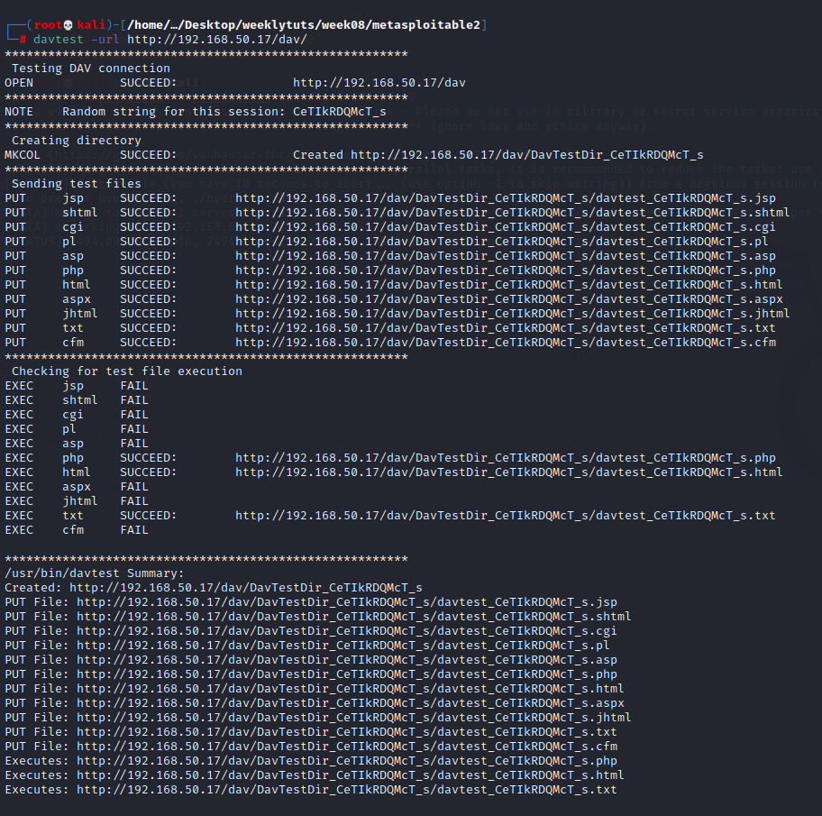

# Exercise 1: Metasploitable 2

Host discovery

nmap full scan: nmap -A –Pn 192.168.50.17

run dirb on port 80

/dav/ directory exist. Run davtest on it to see if it’s vulnerable to WebDAV exploit (which it is)

php upoad & execution works. Upload a php reverse shell and run it

Upload file using cadaver

Open in web: 192.168.50.17/dav/revshell.php

Login to user msfadmin (password: msfadmin) as shown on website

Run a python httpserver containing linpeas so that we can wget it onto target machine

Run linpeas and look for any possible entry points

misconfigured nfs share privilege escalation <https://steflan-security.com/linux-privilege-escalation-exploiting-nfs-shares/>

