# Exercise 1: Ripper 1

IP: 192.168.50.19  
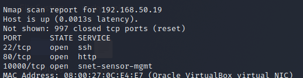

Webpage at port 80 shows a default ubuntu welcome page

Webpage at port 10000

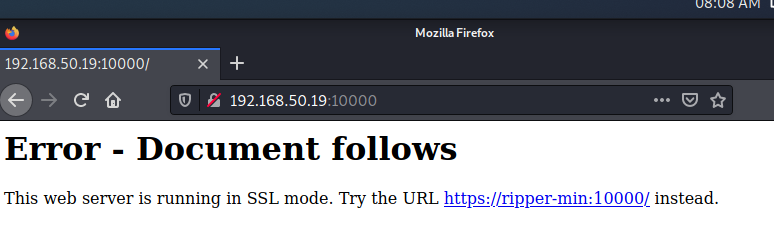

Edit /etc/hosts file:

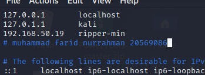

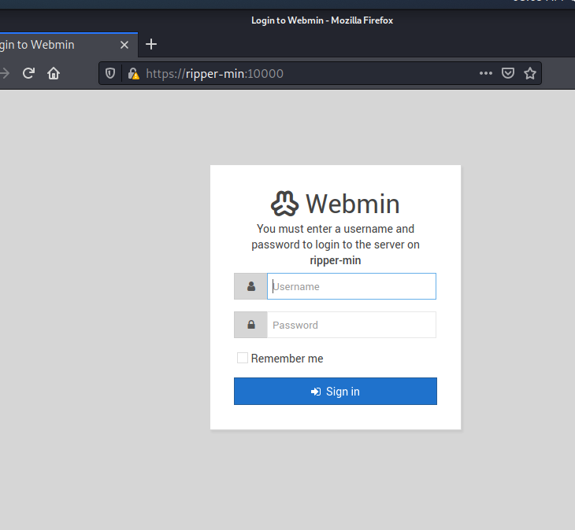

Default login is admin:admin which didn’t work

Running nmap vuln script:  
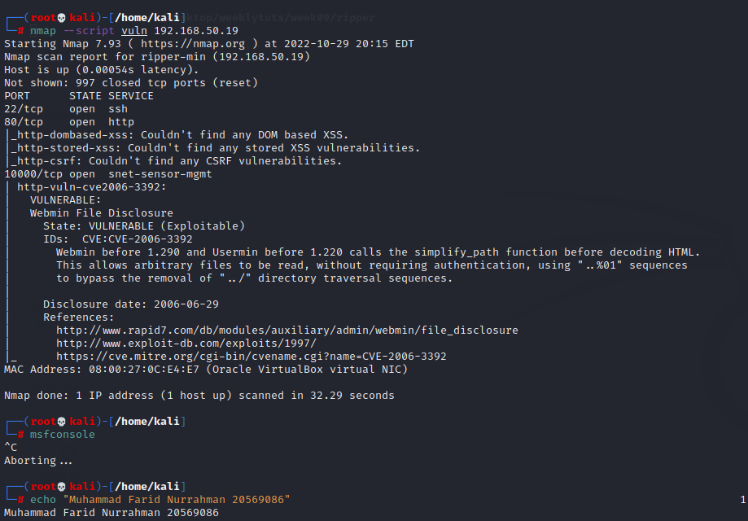

Search on msfconsole

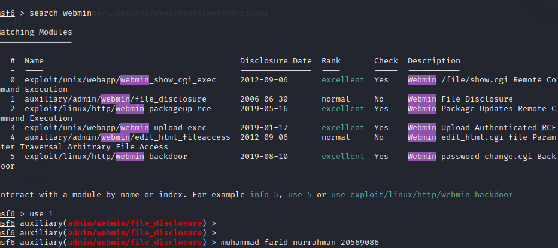

Exploit \#5 looks interesting, seems like there is a password_change.cgi webpage

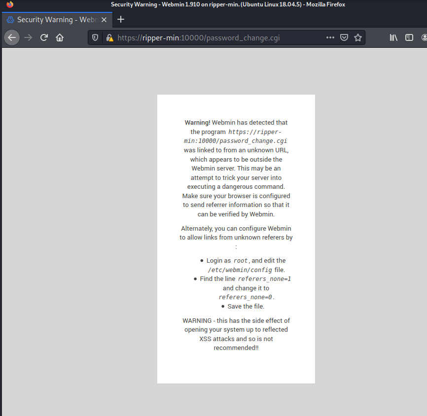

Visiting it looks like this. Seems like root is a user. We can now try to bruteforce our way into webmin

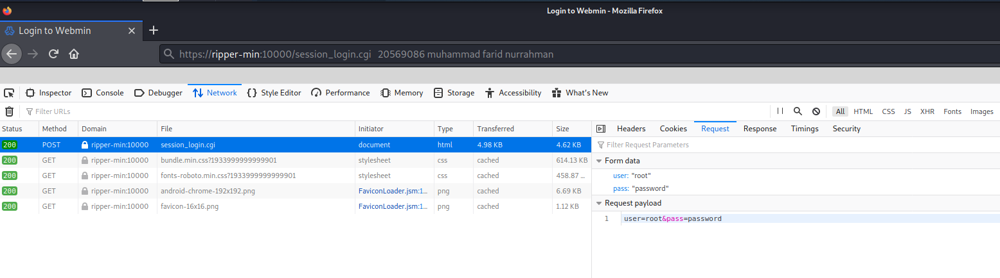

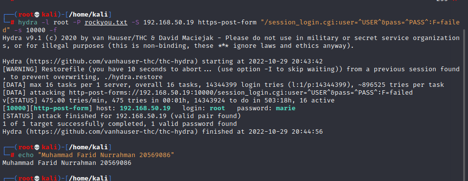

hydra -l root -P rockyou.txt -S 192.168.50.19 https-post-form "/session_login.cgi:user=\^USER\^&pass=\^PASS\^:F=failed" -s 10000 -f

However, upon entering the credentials root:marie, the login page still shows login failed error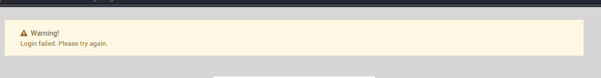

So I decided to run hydra again but with users from users.txt:  
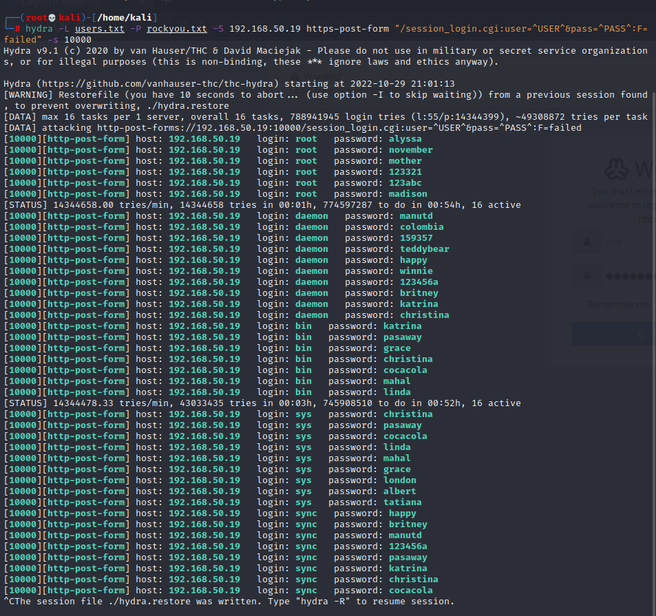

Obviously, there is something wrong. At this point I gave up for entry points, so I followed a walkthrough: <https://resources.infosecinstitute.com/topic/ripper-1-vulnhub-ctf-walkthrough/>

Seems like there is a /rips/ directory which I could not find using dirb

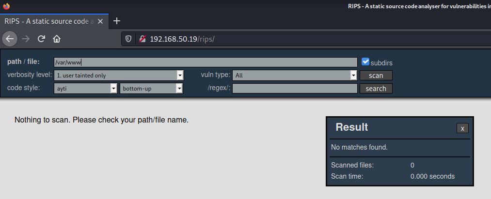

scan /var/www

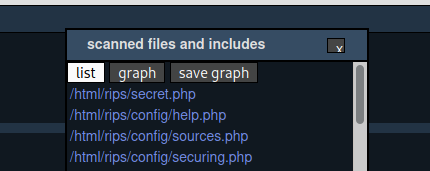

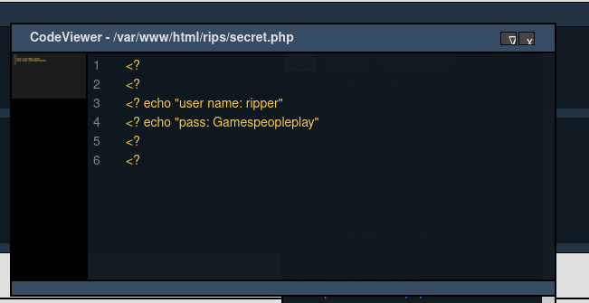

secret.php exists, containing login details. Tried on webmin login page which did not work.

Tried it on ssh and it worked

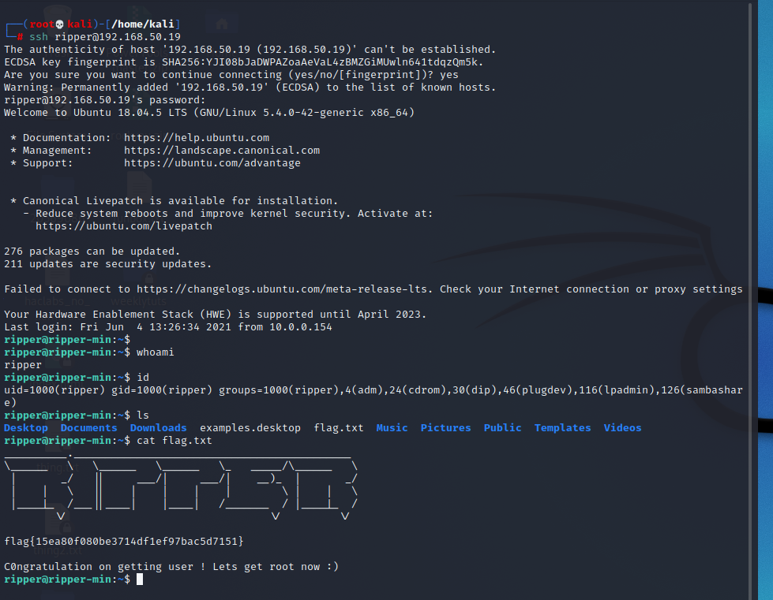

Secret file at /mnt/secret.file which is the password to user ‘cubes’:  
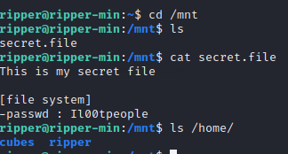

Bash history reveals a file where the webmin login details are potentially saved

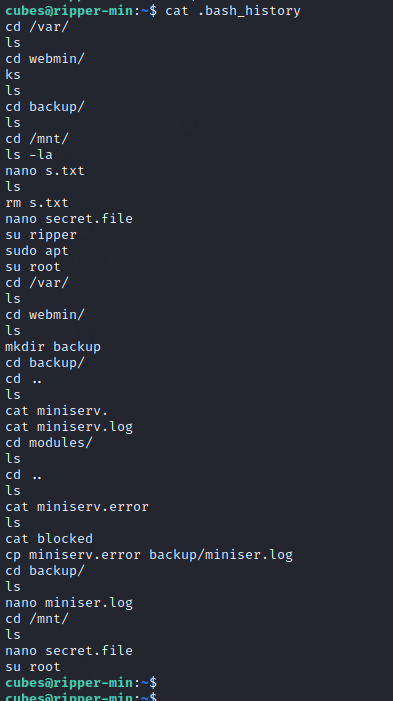

In the contents of /var/webmin/miniserv.log lies the webmin admin

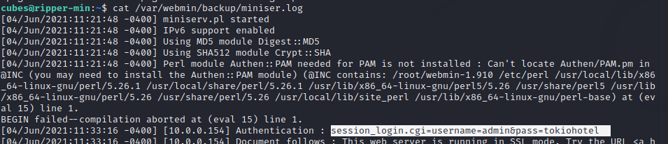

Clicking on terminal icon on the sidebar opens a terminal where we are logged in as root

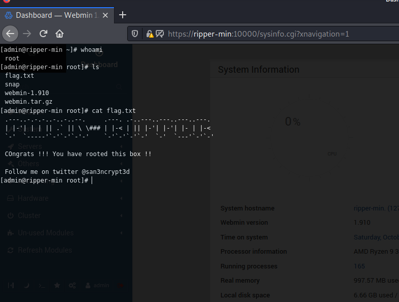
