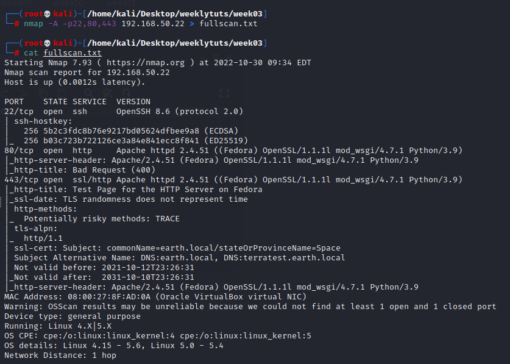

# Exercise 1: The Planets Earth

192.168.50.22

Nmap scans:

Webpage at port 80 only shows a big bold text saying Bad Request (400)

add entry to /etc/hosts

visit on web browser: <https://earth.local/>

terratest.earth.local: 

testingnotes.txt:  

testdata.txt:  

Can’t find a way to decrypt
